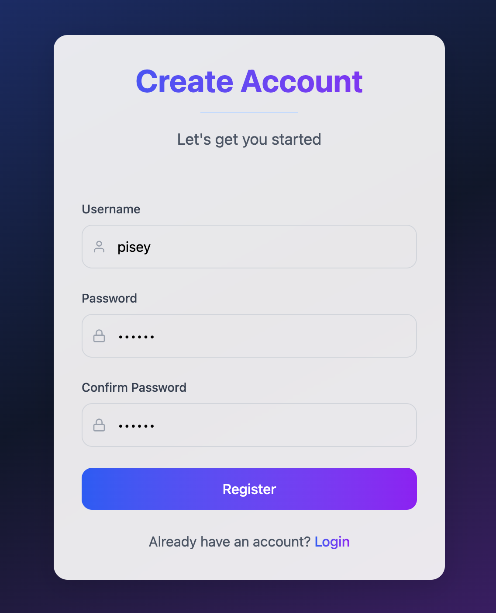
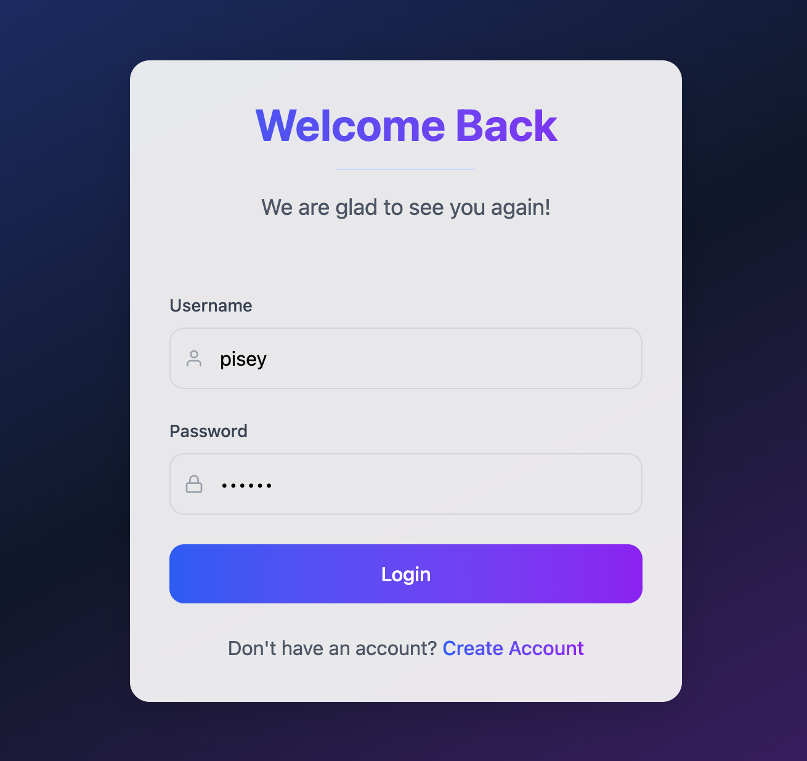
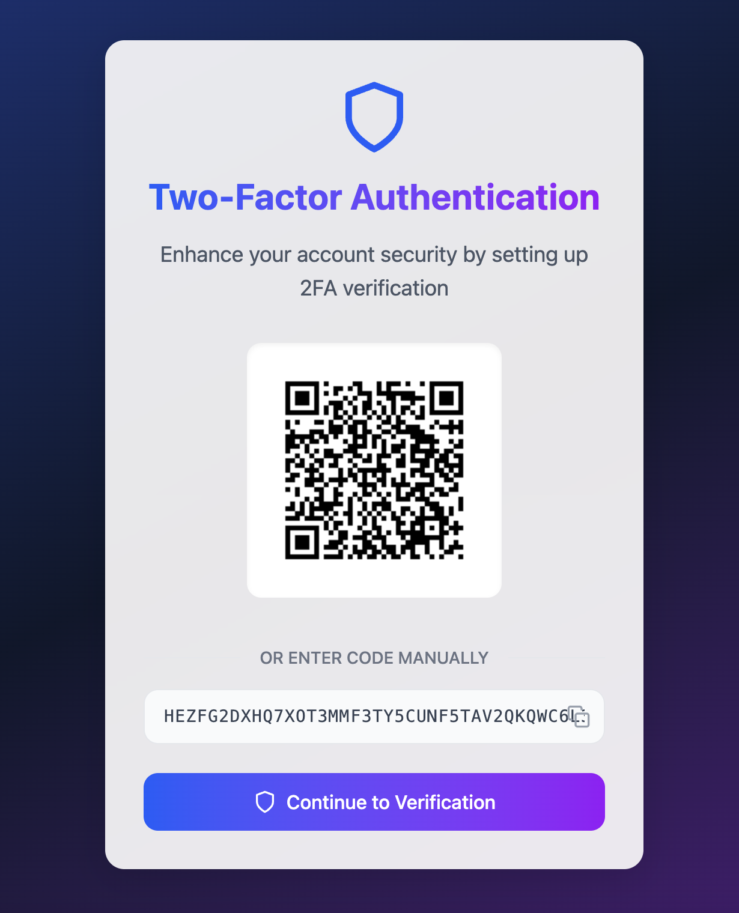
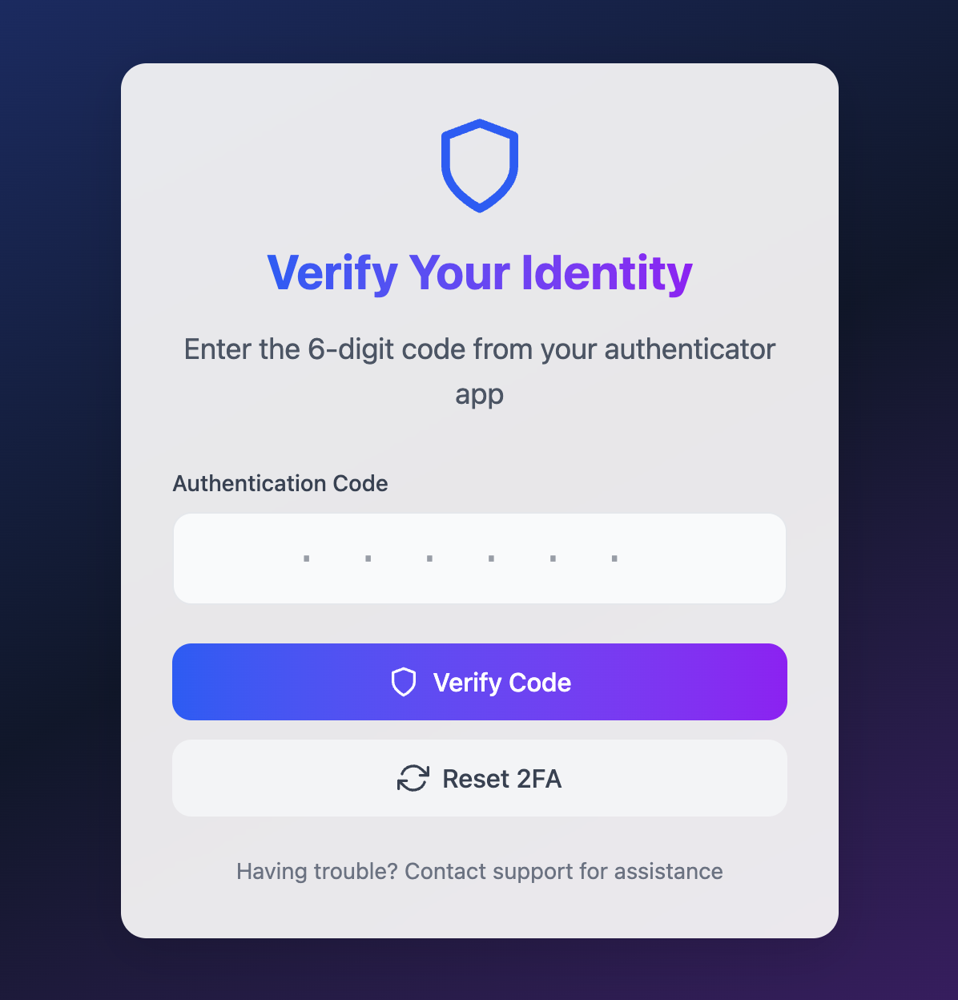

# React-NodeJS MFA Project

This project implements a multi-factor authentication (MFA) system using React for the frontend and Node.js for the backend.

## Project Screenshot






## Project Structure

- `client/`: Contains the React frontend application
- `backend/`: Contains the Node.js backend application

## Backend

### Overview

The backend is built with Node.js and Express. It handles user authentication, including TOTP generation and validation.

### Key Features

- User registration and login
- TOTP secret generation and QR code provisioning
- TOTP code validation during login

### Dependencies

- `express`: Web framework for Node.js
- `otplib`: Library for generating and validating TOTP codes
- `qrcode`: Library for generating QR codes
- `mongoose`: MongoDB object modeling tool

### Setup

1. Install dependencies:
    ```bash
    npm install
    ```

2. Configure environment variables:
    - `MONGO_URI`: MongoDB connection string
    - `JWT_SECRET`: Secret key for JWT

3. Start the server:
    ```bash
    npm start
    ```

## Client

### Overview

The client is built with React. It provides a user interface for registration, login, and TOTP code entry.

### Key Features

- User registration and login forms
- QR code display for TOTP setup
- TOTP code entry form

### Dependencies

- `react`: JavaScript library for building user interfaces
- `axios`: Promise-based HTTP client for making API requests
- `react-router-dom`: Declarative routing for React applications

### Setup

1. Install dependencies:
    ```bash
    npm install
    ```

2. Start the development server:
    ```bash
    npm start
    ```

## Running the Project

1. Start the backend server.
2. Start the frontend development server.
3. Open the client application in your browser and register a new user.
4. Follow the prompts to set up TOTP and log in using the generated codes.
